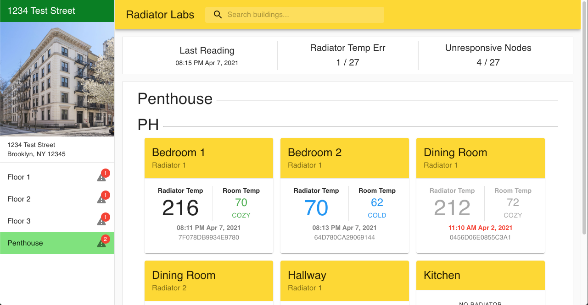

# steam-power
Dashboard to monitor steam radiators in NYC buildings. Built as a coding challenge for [Radiator Labs](https://www.radiatorlabs.com/)



---
## Technology
- React
- Material UI
- Node
- Express
- Webpack
- Babel
- Docker

## Deployed Version

A deployed version can be found [HERE](https://radiator-labs.herokuapp.com/) (Give it a few seconds load it's on a free Heroku account)
## Running Application

## Requirements
  - Node v14.x or Docker
## Installation

Clone the repo to your computer
```
git clone https://github.com/cchauche/steam-power.git
```

Move in to the projects root directory
```
cd steam-power
```

Install dependencies
```
npm install
```

Build the client bundle
```
npm run build
```

Once the build is complete start the server
```
npm start
```

The app should now be running at http://localhost:3030

## Running With Docker

Clone the repo to your computer
```
git clone https://github.com/cchauche/steam-power.git
```

Move in to the projects root directory
```
cd steam-power
```

Using the docker-compose file
```
docker-compose up -d
```

The app should now be running at http://localhost:3030
